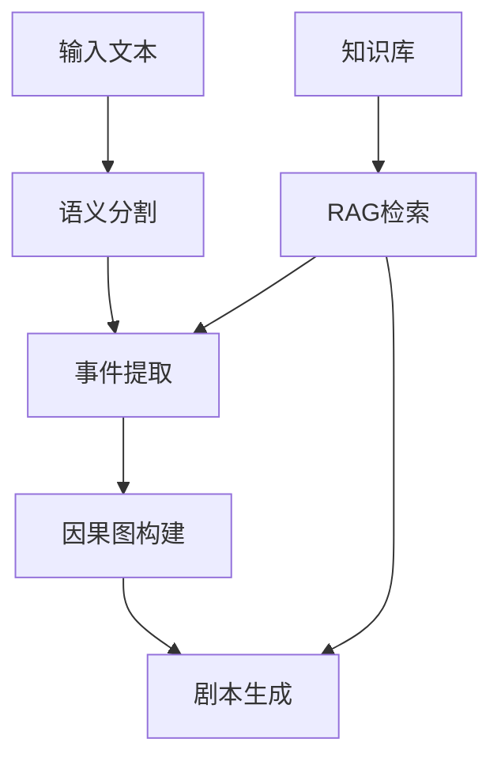

非常好，既然你要**复现这篇论文所提出的Reader–Rewriter（R²）框架**，我将基于你提供的内容，分模块整理出**完整的复现步骤、技术选型建议和代码组织结构**，并附上关键提示（prompt design）与数据流程建议。

---

## ✅ 总览：R²系统复现模块拆解

整个系统可拆解为以下 **4个主要阶段 + 2个算法模块**：

### 📌 主要模块

| 模块            | 功能                        | 对应论文方法        |
| ------------- | ------------------------- | ------------- |
| 1️⃣ 数据预处理     | 将小说切分为章节，准备事件提取和角色信息提取的数据 | 输入准备          |
| 2️⃣ Reader    | 提取角色档案与情节事件 + 构建因果图       | HAR + CPC     |
| 3️⃣ Rewriter  | 根据大纲与因果图生成剧本内容            | 使用HAR优化每一场景生成 |
| 4️⃣ HAR & CPC | 细化 LLM 幻觉输出 & 构建无环因果图     | 关键算法模块        |

---

## 🧱 模块1：数据准备与小说预处理

### 💡 输入格式建议：

- 小说以 **章节划分**（JSON或txt）
- 每章格式如下：

```json
{
  "chapter": 1,
  "title": "The Beginning",
  "content": "Mozart was born in Salzburg..."
}
```

### ✅ 步骤

1. 切分章节
2. 建立每章上下文窗口（用于滑动窗口提取）
3. 准备百科或人物背景知识作为支持文本（support text）

---

## 📖 模块2：Reader（阅读器）

### ✂️ 子模块：Character Event Extraction

#### 🔧 技术选择：

- 模型：GPT-4 / Claude / LLaMA + prompt
- 提取结构：

```json
{
  "event": "Mozart was born",
  "time": "1756",
  "place": "Salzburg",
  "character": "Mozart",
  "description": "Mozart's birth to a musical family."
}
```

#### ⛓ 滑动窗口方法：

- 滑动窗口大小：每次2-3段文本（或按 token 计数）
- 重叠窗口确保上下文一致性

#### 🔄 幻觉修复（调用 HAR）：

每提取一条事件/角色信息，使用 HAR 算法判断并消除幻觉（见下文算法部分）

---

### 🧠 子模块：Causal Plot-Graph Construction（CPC）

1. **因果提取 Prompt 示例：**

```
Q: 以下两个事件是否有因果关系？请用"高/中/低/无"标记，并说明原因。
事件A：Mozart was born in Salzburg.
事件B：He started to compose music at age 5.
```

2. **构建初始图结构**

- 节点：事件集合 \(E\)
- 边：LLM判断后输出因果边 \(D\)
- 权重：高/中/低（High/Medium/Low）

3. **调用 CPC 断环算法**

- 移除成环边（尤其是弱边）
- 最终输出为 DAG 格式的因果图 \(G = \langle E, D, W \rangle\)

---

## ✍️ 模块3：Rewriter（重写器）

### 🔹 Outline Generation（生成结构化大纲）

- 遍历因果图，生成每个场景的：
  - Storyline（故事线）
  - Goal（场景目标）

Prompt 示例：

```
根据以下因果图节点，生成一个场景目标和该场景主要推动情节：
事件：Mozart starts traveling with his father...
```

### 🔹 Screenplay Generation（逐场景生成）

- 每个场景作为输入单元
- 使用 HAR 多轮迭代生成剧本文本

最终输出格式（可JSON或剧本格式）：

```json
{
  "scene": 1,
  "goal": "Mozart travels to Italy",
  "script": "INT. OPERA HOUSE - NIGHT. Young Mozart bows..."
}
```

---

## 🔁 模块4：HAR（幻觉感知细化）

### 🧠 算法 1：幻觉感知细化（Hallucination-aware Refinement）

#### ✅ 输入要求（Require）：

- `x₀`：初始输入文本
- `s`：支持文本（support text）
- `𝓜`：LLM（大型语言模型）
- 提示集 `{p_fb, p_refine}`：
  - `p_fb`：用于反馈定位幻觉的提示
  - `p_refine`：用于执行细化生成的提示
- `stop(·)`：停止条件函数
- `retrieve(·)`：根据幻觉位置获取上下文的检索函数
- `p_refine`：用于训练过的输入-输出-反馈四元组样例集合

#### 🧾 主循环逻辑：

```python
1: for iteration t ∈ {0, 1, ...} do
```

🔁 对每一轮迭代执行以下步骤：

```python
2: locₜ, sugₜ ← 𝓜(p_fb ‖ xₜ)
```

📍 定位幻觉位置 `locₜ`，并生成对应细化建议 `sugₜ`

```python
3: cₜ ← retrieve(locₜ, s)
```

🔍 从支持文本中检索与幻觉位置相关的上下文 `cₜ`

```python
4: if stop(locₜ, sugₜ, t) then
5:     break
```

⏹ 检查停止条件：若幻觉已被充分消除，则退出循环

```python
7: rₜ ← 𝓜(p_refine ‖ cₜ ‖ sugₜ)
```

✍️ 使用 LLM 生成细化后的内容 `rₜ`（结合上下文和建议）

```python
8: xₜ₊₁ ← Merge rₜ into xₜ
```

🔁 将细化结果合并回原文本中，更新输入为 `xₜ₊₁`

```python
11: return refined and consistent output xₜ
```

✅ 返回最终经过多轮细化的一致性输出 `xₜ`

### 📌 总结要点

| 步骤    | 功能           | 说明                  |
| ----- | ------------ | ------------------- |
| 幻觉检测  | `locₜ, sugₜ` | 由 LLM 检测出不一致区域与改写建议 |
| 上下文检索 | `cₜ`         | 支持基于幻觉位置构建上下文       |
| 自我细化  | `rₜ`         | 生成内容用于修正幻觉片段        |
| 输入更新  | `xₜ₊₁`       | 将改进内容融入原输入，进入下一轮迭代  |

---

## 🔄 模块5：CPC（因果图断环）

### 🧾 Algorithm 2：原始伪代码及翻译

```python
1: Sort D by W (from high to low) and the sum of endpoints degrees (from less to more)
```

> 按照边的因果强度从高到低排序；若相同，则按端点事件度数总和从小到大排列。

```python
2: for each edge d ∈ D and its endpoints a, b, where a, b ∈ E do
```

> 遍历边 d(a, b)，其中 a 为起点事件，b 为终点事件。

```python
3: if a ∈ S_b then
4:     continue
```

> 如果 a 在 b 的可达集合中，说明加入该边会成环，跳过。

```python
6: Add d to F
```

> 否则将边加入最终保留集 F。

```python
7: Update S_x of each endpoint x for all edges in F
```

> 更新所有终点的可达集合。

```python
9: return F as the causal relation edge set of the DAG
```

> 返回最终无环因果图边集。

---

### 🧠 中文案例一：抽象例子

事件集：E = {A, B, C, D}\
边集：

- d1: A → B (High)
- d2: B → C (Medium)
- d3: C → A (Low)
- d4: C → D (High)

排序后边顺序：d1, d4, d2, d3
执行过程跳过 d3（因构成 C→A→B→C 的环），最终得到无环因果图 F = {d1, d4, d2}

图结构如下：

```
A → B → C
      ↘
        D
```

---

### 🎭 中文案例二：实际场景模拟

#### 📘 情节事件集合 E：

| 编号 | 事件内容     |
| -- | -------- |
| A  | 学生制定学习计划 |
| B  | 学生开始刷题训练 |
| C  | 学生情绪崩溃   |
| D  | 学生参加考试   |
| E  | 成绩不理想    |

#### 🔗 原始边集 D：

| 边编号 | 边     | 权重       |
| --- | ----- | -------- |
| d1  | A → B | High     |
| d2  | B → C | Medium   |
| d3  | C → A | Low（构成环） |
| d4  | B → D | High     |
| d5  | D → E | High     |

#### ✅ 执行结果：

最终边集 F = {A→B, B→C, B→D, D→E}，跳过 C→A

图结构：

```
A → B → D → E
      ↘
        C
```

---

### 📌 总结

| 步骤       | 说明                     |
| -------- | ---------------------- |
| 1️⃣ 排序   | 边按强度排序，高优先、度小优先        |
| 2️⃣ 初始化  | 每节点一个初始可达集合            |
| 3️⃣ 遍历边  | 若形成环则跳过，否则加入 F 并更新可达集合 |
| 4️⃣ 返回 F | 生成最终无环因果图结构            |

---

## 📦 项目结构建议、工具

### 📁 项目结构建议

```
N2SG_Replication/
├── data/                         # 小说原文与背景资料
├── src/
│   ├── reader/
│   │   ├── event_extractor.py   # LLM调用+滑动窗口提取角色与事件
│   │   └── har.py               # HAR算法模块
│   ├── graph/
│   │   ├── causal_graph.py      # CPC图构建与断环逻辑
│   │   └── visualizer.py        # 可视化DAG因果图
│   ├── rewriter/
│   │   ├── outline_generator.py # 场景大纲生成
│   │   └── screenplay_writer.py # 场景剧本生成与HAR优化
│   └── utils/
│       └── prompt_templates.py  # 所有Prompt模板结构
├── outputs/                     # 最终生成剧本片段、结构图
└── README.md
```

### 🛠 推荐工具栈

| 工具/库                | 用途              |
| ------------------- | --------------- |
| OpenAI API / Claude | 主模型调用           |
| LangChain           | Prompt组装与多轮交互控制 |
| networkx / pyvis    | 因果图结构构建与可视化     |
| Streamlit / Gradio  | 快速搭建交互式脚本生成界面   |
| Weights & Biases    | 追踪多轮HAR优化与模型表现  |
| tqdm / loguru       | 日志与进度可视化支持      |

### 🚀 开发与测试建议

- 所有模块应支持单元测试（可使用 pytest）
- LLM调用部分应封装接口，支持快速替换模型（OpenAI, HuggingFace, Claude等）
- 可加入 caching 机制，减少重复调用成本
- 若支持数据分析与自动评估，推荐引入 NLTK / SpaCy 等文本分析库

---

## 🔄 整合到现有项目结构

基于当前项目的代码结构，我们可以将 R² 框架整合到以下位置：

### 📁 更新后的项目结构

```
src/
├── core/                           # 核心功能实现
│   ├── text_processor.py          # 文本处理核心（已有）
│   ├── ai_review.py              # AI审校功能（已有）
│   └── r2_framework/             # R² 框架核心实现（新增）
│       ├── __init__.py
│       ├── reader.py             # Reader模块实现
│       ├── rewriter.py           # Rewriter模块实现
│       └── event_processor.py    # 事件处理与因果图构建
│
├── utils/                         # 工具函数集合
│   ├── ai_utils.py              # AI工具函数（扩展）
│   ├── text_utils.py            # 文本处理（扩展）
│   ├── semantic_divider.py      # 语义分割（复用）
│   ├── rag_utils.py            # RAG系统（复用）
│   ├── graph_utils.py          # 新增：因果图处理工具
│   ├── har_utils.py            # 新增：HAR算法实现
│   └── cpc_utils.py            # 新增：CPC算法实现
│
└── models/                       # 新增：模型定义
    ├── __init__.py
    ├── event.py                # 事件模型定义
    ├── character.py            # 角色模型定义
    └── causal_graph.py        # 因果图模型定义

### 🔄 功能整合说明

1. **Reader 模块整合**
   - 复用 `semantic_divider.py` 的语义分割功能
   - 扩展 `ai_utils.py` 添加事件提取能力
   - 新增 `har_utils.py` 实现幻觉修复
   - 利用 `rag_utils.py` 进行知识检索

2. **Rewriter 模块整合**
   - 复用 `text_processor.py` 的文本处理功能
   - 扩展 `ai_review.py` 支持剧本生成
   - 利用 `har_utils.py` 进行生成内容优化

3. **图构建模块整合**
   - 新增 `graph_utils.py` 处理因果图
   - 新增 `cpc_utils.py` 实现断环算法
   - 利用 `models/causal_graph.py` 定义图结构

### 📦 具体实现建议

1. **HAR 算法实现 (`har_utils.py`)**
```python
class HARProcessor:
    def __init__(self, llm_client):
        self.llm = llm_client
        
    def detect_hallucination(self, text, support_text):
        """检测文本中的幻觉内容"""
        pass
        
    def refine_content(self, text, context):
        """根据上下文优化内容"""
        pass
```

2. **CPC 算法实现 (`cpc_utils.py`)**
```python
class CPCProcessor:
    def __init__(self):
        self.graph = nx.DiGraph()
        
    def add_causal_edge(self, event_a, event_b, weight):
        """添加因果边"""
        pass
        
    def break_cycles(self):
        """执行断环算法"""
        pass
```

3. **事件处理器 (`event_processor.py`)**
```python
class EventProcessor:
    def __init__(self, har_processor, cpc_processor):
        self.har = har_processor
        self.cpc = cpc_processor
        
    def extract_events(self, text):
        """提取事件"""
        pass
        
    def build_causal_graph(self, events):
        """构建因果图"""
        pass
```

### 🔗 与现有功能的集成点

1. **文本处理流程**
   - 语义分割 → 事件提取 → 因果图构建 → 剧本生成

2. **AI 调用扩展**
   - 扩展 `ai_utils.py` 的 Function Calling Schema
   - 添加事件提取和关系判断的 prompt 模板

3. **RAG 系统整合**
   - 利用现有的 RAG 系统进行知识检索
   - 支持 HAR 算法的上下文构建

### 📊 数据流转示意



### 🛠 开发建议

1. **分阶段实现**
   - 第一阶段：实现基础的事件提取
   - 第二阶段：添加 HAR 算法
   - 第三阶段：实现因果图构建
   - 第四阶段：完成剧本生成

2. **测试策略**
   - 为每个新模块编写单元测试
   - 设计端到端的集成测试
   - 建立自动化评估指标

3. **性能优化**
   - 实现结果缓存机制
   - 优化 LLM 调用次数
   - 支持批量处理

---

